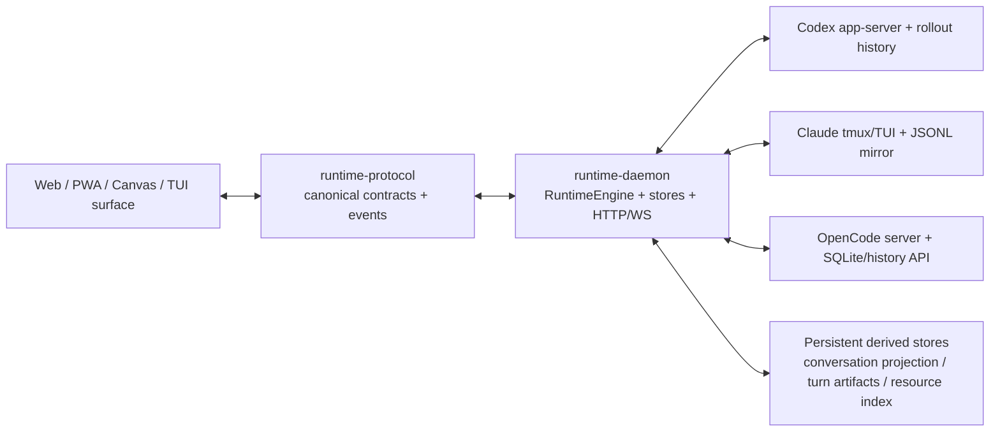

# RAH Agent Handover

> 复核时间：2026-08-13（Asia/Shanghai）
> 仓库：`/Users/sun/Code/repos/rah`
> 用途：让下一位 Agent 在不依赖超长对话历史的情况下，快速理解 RAH 的架构、产品约束、当前工作区和接手顺序。
> 注意：这是交接快照，不替代代码、协议测试和 [`docs/README.md`](./docs/README.md) 中列出的权威文档。

---

## 0. 先读这一页：当前最重要的事实

RAH 是一个 **local-first、多 Provider、daemon-owned runtime 的 AI 工作台**。它不是 Codex Desktop 的网页壳，也不是把 TUI 字符串搬到浏览器里显示。

最重要的系统边界如下：

1. **daemon 是运行时唯一 owner**：负责 Codex、Claude、OpenCode 的启动、恢复、控制、事件、历史目录、投影和索引；浏览器只是 canonical protocol 的消费者。
2. **Provider 原生结构化数据是权威**：实时会话来自 Provider server event 或原生历史 mirror；绝不从 ANSI/TUI 屏幕文本反推 Chat。
3. **历史浏览与 running runtime 分离**：历史 session 可以只读打开；首次发送时才用单个 daemon 请求原子执行 live Resume/Attach 并接管首条输入。打开历史本身不启动 Provider。
4. **Chat、Workspace、Chats Catalog、Inspector 各有唯一 owner**：禁止某个页面自己再维护一套扫描、缓存或 projection。
5. **所有列表必须确定、稳定、幂等**：刷新、窗口失焦/聚焦、Session A→B→A、Provider 后台变动，都不能让左侧数量/顺序抖动或出现重复项。
6. **Inspector 只能展示稳定快照**：Outputs/Sources 索引重建期间返回旧稳定值或 `indexing`，不能让用户看到计数逐项增加、列表不断重排。
7. **本轮 Changes 不能用当前 Git 状态伪造**：只接受 Provider 权威的 per-turn diff artifact；旧历史没有 artifact 时明确显示 unavailable。
8. **Provider 子进程必须和 RAH 隔离**：单个 Codex/Claude/OpenCode 高 CPU、海量 stdout 或卡死，不应拖死 daemon 和 Web；只有整机资源耗尽是不可避免边界。
9. **不要补丁式修复**：先确定 canonical owner、identity、状态机和不变量，再补单元测试、协议测试、真实浏览器回归门禁。
10. **先守入口，再扩功能**：New / Resume / Attach 的首问只有收到同 identity 的 `session.input.accepted` 才算成功；进程启动、PTY 写入、RPC 返回或队列消失都不是交付。相关架构审查见 [`docs/architecture-review-2026-08.zh-CN.md`](./docs/architecture-review-2026-08.zh-CN.md)。

---

## 1. 当前仓库与在线实例快照

### 1.1 Git

- 当前分支：`main`
- 当前已推送基线：`7959805`（`fix: make session startup delivery atomic`）。
- Web/Workspace 前置基线：`b12c1ce`（`fix(web): stabilize workspace lifecycle and PWA layout`）。
- Runtime/历史前置基线：`9384c5b`（`fix(runtime): stabilize Codex catalog and history convergence`）。
- 本轮工作可能位于未提交工作树；任何 Agent 都必须先用 `git status --short` 和 `git diff` 审查来源，不能 reset/revert 用户改动，也不能根据本文声称 worktree clean、已 push 或已 restart。

近期已提交的重要提交：

- `30a3df1` `feat: unify conversation UX and session continuity`
- `287c426` `refactor: harden session loading and history boundaries`
- `6e2f699` `feat: stabilize session resources and inline visuals`
- `ec9bf4a` `docs: define stored history authority and loading`
- `1ffa819` `fix(history): make provider catalogs authoritative`
- `d1e0c58` `feat: harden conversation runtime and resource isolation`
- `e14c5f1` `feat(chat): align Worked activity disclosure`
- `1fe5506` `feat(workbench): harden history and optimize loading`

### 1.2 在线 daemon

- 固定地址：`http://127.0.0.1:43111/`
- PID 文件：`/Users/sun/.rah/runtime-daemon/daemon-43111.pid`
- 日志：`/Users/sun/.rah/runtime-daemon/daemon-43111.log`
- PID、Runtime ID 与 Web build ID 都是重启即变化的运行态，不再固化到 handover。读取 `node bin/rah.mjs status`、`/api/runtime` 与 `packages/client-web/dist/.rah-web-build.json` 获取当前值。
- 只有用户明确授权时才重启；代码审查、构建和隔离 browser smoke 不构成重启授权。本轮明确要求过程中不重启在线 RAH。

不要无故重启 daemon。重启会打断由 RAH 管理的 live Provider runtime；只有用户明确要求、构建 generation 不一致或修复确实需要进程重载时才做。

### 1.3 用户明确要求保留的 Session

以下历史仍在使用，禁止未经明确授权删除或归档：

- `019f8466-3906-71b2-b850-1ac8bf145a5e`（`solars_new`）
- `019f8436-b0dd-7863-9da7-09ddcfc74e6a`（`rah_develop`，本次长对话）
- `019f7d82-3eaa-7093-8d75-27a51b60e2cf`

---

## 2. 产品北极星与非目标

### 2.1 产品北极星

RAH 要实现的是：

- 一个 daemon 持有多个 Provider runtime；
- Web、PWA、手机、平板、Canvas 和原生 TUI 可以接入同一个 Session；
- 历史 Session 像本地资料库一样立即可浏览；
- 首次继续提问时无中转页、无 Resume 按钮，直接进入 Chat 并在后台恢复；
- Provider 差异在 adapter 层归一化，UI 只理解 canonical events；
- 大历史、大 Git 仓库和高负载 Provider 下，UI 仍保持快速、稳定、可恢复。

### 2.2 非目标

- 不把 Codex App Server 的每个内部事件都做成主 UI 功能。
- 不解析 TUI ANSI 输出生成 Chat 历史。
- 不以文本相似、时间窗口或 DOM 扫描作为主 identity。
- 不用当前 workspace 的全局 `git diff` 猜某个历史 turn 的改动。
- 不为 Canvas、PWA、Inspector tab 各自复制一套 Session store、请求或缓存。
- 不用前端隐藏来假装 Archive；归档必须有 Provider-native 或物理可恢复边界。
- 不让 Chats 的 All catalog 改写左侧 Workspace/Session 投影。

---

## 3. 架构总览



### 3.1 包职责

| 包 | 核心职责 | 不能做的事 |
| --- | --- | --- |
| `packages/runtime-protocol` | API、事件、Session capability、contract validator、canonical identity | 不能泄漏 Provider 原生 payload 作为主 UI 契约 |
| `packages/runtime-daemon` | HTTP/WS、RuntimeEngine、Provider adapters、Session lifecycle、历史目录、projection、resource index、turn artifact、PTY/TUI surface | 不能把浏览器变成 runtime owner，也不能从 ANSI 反推结构化 Chat |
| `packages/client-web` | React 19 workbench、Zustand orchestration、Chat/Composer/Inspector/Sidebar/Canvas/PWA | 不能解释 Provider 原生日志，不能创建第二套历史或 Inspector 扫描 |

### 3.2 关键运行对象

- `RuntimeEngine`：daemon API/生命周期主编排器；workspace/git/file inspection 已委托给 `RuntimeWorkspaceOperations`，不能重新吸收底层文件操作。
- `SessionStore`：managed session truth。
- `EventBus`：canonical event 分发。
- `PtyHub` / `RuntimeTerminalCoordinator`：TUI surface 生命周期；Chat 浏览不应隐式 attach TUI。
- `HistorySnapshotStore` / stored history catalog：历史目录与分页读取。
- Conversation projection store：持久化 canonical Conversation 派生结果。
- Turn artifact store：Provider 权威的 per-turn diff 冻结快照。
- Conversation resource index：Outputs/Sources 的持久化稳定快照。
- `useSessionStore`：前端 orchestration shell；具体迁移由 owner 模块负责。
- `App`：workbench composition root；lazy page registry、New Session draft persistence、foreground Session recovery 与 file preview error boundary 分属独立 owner，不能再内联回 `App.tsx`。

### 3.3 网络与认证

- daemon 统一入口：`http://127.0.0.1:43111/`
- Vite dev：`http://127.0.0.1:43112/`
- daemon 有意监听 `0.0.0.0` 以支持局域网/PWA。
- `127.0.0.1` / `localhost` 免配对；LAN、Tailscale、代理入口必须走设备认证与 `rah pair`。
- 任意 host 文件预览只能走受认证的 file preview route；静态服务不能退化成任意磁盘文件服务器。

---

## 4. Provider 边界

| Provider | 默认 running path | 实时结构化来源 | 历史权威来源 | 关键注意事项 |
| --- | --- | --- | --- | --- |
| Codex | `native_local_server` | Codex app-server event | rollout/session history | Codex Desktop 的全部用户根会话（包括 `codex_work_desktop`）进入 catalog；internal subagent 排除；同一 rollout identity 必须去重 |
| Claude | `tui_mux_fallback` | TUI 维持现场；Chat 通过历史 mirror | `~/.claude/projects/**/*.jsonl` | 不从屏幕 ANSI 解析 Chat；Archive 计划是物理隔离 JSONL + manifest 可恢复 |
| OpenCode | `native_local_server` | OpenCode serve/session events | 官方 message/history API + SQLite stored history | Provider-native archive 仅在官方 API 稳定时采用 |

Provider adapter 的规则：

1. 描述 agent 工作的事件映射为核心 workbench event。
2. 描述 host/runtime/provider bookkeeping 的事件映射为 infrastructure event。
3. 未知或损坏事件保留 raw diagnostics，但不扩张主 UI event family。
4. 新 Provider 必须显式声明 capability；UI 不能猜能力，也不能伪造 branching/archive/control。

### 4.1 Canonical identity

Timeline 主 identity 来自：

`provider + providerSessionId + turnKey + itemKind + itemKey`

- `origin`（live/history）不参与 identity。
- `contentHash` 只做校验或弱 fallback。
- `sourceCursor` 只保存证据位置。
- 前端遇到 `canonicalItemId` 必须 upsert；旧事件才允许 message id/text/time fallback。
- 不可通过文本相同或时间接近去重 user/assistant/tool row。

---

## 5. Session 生命周期与直接进入 Chat 的 UX

### 5.1 Session 类型

1. **Native local server running**：Codex/OpenCode 默认。
2. **TUI mux fallback running**：Claude 默认。
3. **Read-only replay**：仅浏览 Provider 历史，不属于 running。
4. **Structured test running**：内部测试 harness，不是公开生产主路径。

`ready`、`working`、`waiting_input`、`waiting_permission` 是 phase，不是 running/stopped 边界。

### 5.2 New 与历史 Resume 的统一体验

用户已明确锁定以下行为：

- New task 输入发送后直接进入 Chat，不出现中转页；首问文本、附件、注释及稳定 message/turn identity 必须作为 `initialInput` 原子进入 `/sessions/start`，禁止依赖跳转后的第二次 `/input`。发出 mutation 前客户端必须等待当前 event transport 的 initial replay 完成，以建立 baseline -> activation -> live delta 的因果顺序，不能用重连代替这一屏障。启动期间 daemon 必须把唯一输入接入该 Session 的 canonical queue；HTTP 成功必须晚于 Provider 对这条 identity 的明确接收，不能只代表 Session 已创建或内存队列已接管。只有 provider-bound startup 成功才转移草稿所有权，任何拒绝都恢复问题与附件，且同一提交在完成前必须互斥。临时 New projection 交接时只保留乐观草稿/配置，canonical conversation 以真实 Session 已收到的 live projection 为准；历史 Resume 相反，以 resident stopped transcript 为 baseline 再叠加 live lifecycle/delta，二者禁止共用不区分权威的 spread/merge。
- 历史 Session 第一次发送后，问题气泡立即乐观出现，不等待 Resume 完成。
- Composer 立即在原 Send 槽位切换为黑底白色、无动画的 Stop；用户继续输入时同槽恢复 Send。
- Chat 过程行与 Sidebar 运行指示先显示 `Starting/Working`；Provider 接管后继续沿用同一 daemon-owned 状态，不能依赖标题栏临时文案。
- 不显示独立 Resume 按钮。
- Resume 失败时保留历史 projection，恢复 draft 与附件，不清空用户输入。
- stopped history 的首问必须作为同一个 `/sessions/resume` 请求的 `initialInput` 交给 daemon；live resume 失败不得伪装为成功的 read-only replay。HTTP 在 Codex 接受对应 `turn/start` 之前不得返回成功；等待期间 daemon 必须拥有该输入并把 `submitting` 项投影为可刷新的用户消息/Working。Codex 明确拒绝或 transport 结果不确定时输入继续留在 canonical queue，不能从 UI 和刷新结果中消失。
- 同一 Provider thread 的并发首次提交共享一个 in-flight resume，不能创建两个 runtime。若用户先触发了无输入的激活、随后才按 Send，后到的问题必须先乐观写入 resident projection，并在已有 Resume 返回后向新的 Runtime ID 恰好发送一次；若已有 Resume 本身已携一条输入，后续每条输入仍必须拥有独立排队路径，不能因为复用在途 Promise 而吞掉输入。
- Resume 返回的迟到 `idle` snapshot/notification 在 `turn/start` 尚未确认、canonical queue 仍有输入时不得覆盖 `Starting/Working`。Sidebar 点、标题、composer Stop/Send 与 Chat 状态都必须来自同一 daemon-owned Session state，而不能各自猜测“已启动”等于“已投递”。
- Resume A 的完成只有在用户仍停留于 A 的 history replay 或 A 已 claim runtime 时才可映射当前选择；等待期间若用户打开 B，A 继续后台启动和发送，但成功、回滚及迟到 control refresh 均不得把页面抢回 A。
- stopped -> starting -> live 的整个迁移期间 composer 只切换配置数据源，不卸载权限、Plan 或模型控件；默认模型的默认 effort 必须立即显示，只有 Provider 明确声明“provider default”时才允许省略 effort。
- 用户显式 Stop 当前 Session 后保留当前已加载 conversation projection，并原地降级为 stopped/read-only replay；页面仍停留在同一个 Chat，后续可直接输入并隐式 Resume，不能跳回 New task。
- 浏览器 reload、失焦、PWA 后台只改变 attach，不应 stop Provider。

### 5.3 Composer 草稿与队列

- 每个 Session 必须有独立未发送 draft；A 输入后切到 B，B 是自己的 draft，再回 A 原内容仍在。
  普通 Session Chat 与 Canvas 中指向同一 `{provider, providerSessionId}` 的 pane 必须共享这份仅内存
  draft、附件和注释；Canvas 不能创建第二个 composer state owner。
- running turn 中的追问进入显式 per-session FIFO queue。
- 队列行位于 Composer 上方，支持排序、编辑、删除。
- `Guide` 表示把消息插入当前 turn，而不是等待下一轮。
- Guide 成功后必须以同一 `clientMessageId/clientTurnId` 形成当前 Provider turn 内的 canonical `user_message`，并按 Provider 事件顺序夹在 thinking/activity 之间；不能作为下一轮气泡留在 final 后面。`turn/steer` 与 turn 完成竞态时 queue 继续拥有消息并自动转为下一轮输入，重复点击 Guide 必须幂等，不能报“已不在等待”并丢弃消息。
- `Side` 以该消息打开 side chat。
- 因 `Guide` 已表达“立即插入”，全局“开启/关闭排队”开关没有足够独立语义，倾向移除。
- queue row 与 Provider 接管后的 canonical user row 必须共享稳定 `clientMessageId/clientTurnId`，不能重复显示。`submitting` 已经属于 Conversation row，Composer queue 只显示仍为 `queued` 的项。
- standalone PWA 中 permission、Plan、model/effort、附件、context usage 及其 Portal 菜单都属于同一个 composer 编辑会话：统一由 `composer-focus-ownership.ts` 判定 pointer 所有权，内部交互默认在 `pointerdown` 阶段保留 textarea 焦点，不能关闭输入法或触发单行回缩；只有真正点击 composer/menu 之外或显式标记为 release 的遮罩才允许 blur 与收缩。新增 composer 控件不得自行另写一套 focus/outside-click 分支。

---

## 6. Conversation、历史与 Worked Activity

### 6.1 Conversation 唯一 owner

前端 [`session-store-conversation.ts`](./packages/client-web/src/session-store-conversation.ts) 是 Chat baseline、older paging、WS delta、turn hydration 和 gap recovery 的唯一 owner。

- `useSessionStore.ts` 只组合 owner，不实现另一套 reducer。
- auxiliary events 不能重建 Conversation。
- raw Provider history 不能在 canonical error 后作为 UI fallback。
- [`conversation-item-order.ts`](./packages/runtime-protocol/src/conversation-item-order.ts) 是 turn 内
  语义展示顺序的唯一 owner。Resume 允许 Provider 先持久化 compaction/启动过程、后回写首问，
  但 daemon projector、resident/history overlay、Web baseline/delta 与 renderer 都必须收敛为
  “初始 user → process/后续 Guide → final”；不得把物理 arrival order 当作 UI 顺序，也不得在
  各页面另写 timestamp/CSS 修正。
- 大历史先加载 tail；上滚再取更早分页。
- 不能一次传完整 JSONL/DB 到浏览器。
- 浏览器内存负责页面生命周期内的 Session A→B→A：独立的 bounded Conversation LRU 以
  `{provider, providerSessionId}` 为键，和 daemon Session catalog/sidebar 拓扑分离。catalog refresh、
  stopped replay 回收或 replay gap 不能清空此前已读正文；重选时先同步显示旧 tail，再只对当前可见
  Session 做 canonical tail 校准，失败仍保留旧内容。跨 Runtime ID 恢复不复用旧 revision/cursor，
  replay gap 禁止并发刷新所有非可见 Session。该内存层最多 16 项、单项约 8 MiB、总计约 32 MiB、
  30 分钟 LRU，不得产生 Sidebar row，也不得写 localStorage/IndexedDB。校准响应中的
  `itemsView=summary` 是有界传输视图，缺少旧 process/reasoning item 不是删除证据；同一 provider turn
  必须保留已经展示的 thinking，仅显式 delta removal 或 full canonical view 才能删除。
- 整页 reload 或 iOS 回收 Web 进程后由 daemon-owned canonical page hot cache 加速。该 cache 仅接受
  terminal page，按 Runtime Session/cursor/limit、provider
  `sourceRevision` 与 resident `liveRevision` 精确命中，并受 1 MiB/条、128 条、32 MiB、30 分钟
  LRU 约束。任一 revision 变化即失效；不得把 Conversation 正文放进 localStorage/IndexedDB，
  也不得把旧热页与新 baseline 合并。当前 tab 只在 `sessionStorage` 保存最后选中 Session 的
  `{provider, providerSessionId, workspaceDir}` 轻量身份；reload 后先按 live catalog、再按 Recent/Stored
  解析该身份并请求 canonical page。用户显式回到 New task、Workspace 或 Council 时立即清除此身份，
  不允许持久化 transcript 或用过期 Runtime Session id 复活页面。

### 6.2 历史目录必须权威、稳定

近期已经集中修复：

- Codex catalog 保留 Codex Desktop 的全部用户根会话，只过滤 internal subagent/无关 rollout。
- 同一 Provider thread/rollout 不因 rename、路径别名、多个 catalog source 出现重复项。
- Provider catalog 扫描结果必须稳定排序、幂等合并。
- focus/reload 不能触发前端自行重建或让 session 数量/顺序抖动。
- Stored history、managed runtime 和 UI projection 是不同层；不能互相覆盖为“看起来最新”。

### 6.3 Worked / Working

用户希望接近 Codex Desktop，但使用 Provider-neutral activity protocol：

- 顶部一行显示 `Working`、`Worked Xm Ys` 或 `Interrupted after …`。
- 箭头紧邻标题；空 Worked 没有箭头，也不可点击。
- 展开时保持标题行屏幕锚点，内容向下展开，不让第一行跳动。
- Reasoning 正文默认可见；工具调用按组折叠。
- 每个命令组展开后列命令；命令可进一步展开结果。
- 不允许两个可合并的相邻 command group 被无意义拆开。
- Provider 的 transient planning headings（例如短暂的 “Estimating …”）如果只是运行中状态，不应永久伪装成 reasoning 正文。
- `Context compacted` / `已精简上下文` 必须作为带左右分割线的明确活动 marker 保留。
- 最终回复存在时，Worked 底部用细线和 final answer 分隔；仍在 Working、尚无 final answer 时不画该线。
- 折叠状态也显示细线，但应紧贴 Worked 行和 final answer，不能留下大空白。
- Interrupted 默认展开，以便用户知道中断位置；中断说明只能在 Worked/Interrupted 标题之下。
- 每个 turn 的 provider/model/effort 入口是 `Working / Worked / Interrupted` 状态行最左侧的
  provider 图标；它与状态文字共享一行，不能再占用 final footer 或独立标题行。Desktop 悬停图标、
  PWA 点按图标显示完整 provider/model/effort 与来源；模型事实尚未到达时仍保留 provider 图标。
  final footer 只保留 Copy 等回复动作。

---

## 7. 左侧 Sidebar、Workspace 与 Council

### 7.1 三套展示区域

- **Pinned**：普通 Session 可置顶；支持拖拽排序。
- **Council**：独立区域，只展示 running Council；Council 不再混入 Workspace session，也没有 pin 能力；支持区域内拖拽排序。
- Council agent 的最终答复通过 `channel_post(content="...")` 发布；MCP schema 与 bootstrap prompt 都显式声明 `content`，daemon 同时兼容 `text/message` 别名，不能因模型使用常见 `message` 参数而丢失已生成的答复并终止监听。
- 删除 stopped Council 时，daemon 必须先保留其全部 `providerSessionIds`，再把这些 agent history identity 写入 workbench hidden-session tombstone；删除 Council 不能让原本隔离的 agent 子 Session 回落成普通 Workspace/Recent 行。
- **Workspaces**：注册的 workspace + 其非 archive sessions。

Chats 的 Council tab 另按 Running / Stopped 分组；左侧 Council 区域只负责当前运行对象。

### 7.2 Workspace 与 Chats Catalog 不是同一个 store

这是最容易被误改的边界：

- 左侧 Workspace 列表由 workspace owner + revealed/running session projection 决定。
- Chats Recent/All 是历史资料库投影。
- All catalog 不能新增、删除、重排左侧 Workspace。
- 左侧 Workspace 也不能覆盖 All catalog。
- 普通刷新只加载有界 Recent；All 只有用户首次打开才加载。

### 7.3 Sidebar UI 不变量

- Workspace 行、Session 行、Council 行使用同一行高、hover 宽度、icon column、title origin 和 action column 协议。
- Workspace 标题略重，用于和 Session 区分；不要粗到与正文中文无法区分。
- Provider icon 与 folder icon 大小和位置锁定；标题起点一致。
- 行 hover 覆盖完整行，不因 session 缩进而缩短。
- Workspace 不保留常驻选中色；当前正在浏览的 Session 可以保留与 hover 同深度的 selected 状态，但不额外加深、加粗。
- Desktop：pin/archive 等 action 只在鼠标 hover 或键盘 focus 时显示；鼠标移出立即隐藏，即使该 Session 已选中。
- Session 行尾 action 只能复用整行 hover surface；按钮与 action rail 均保持透明、无投影，不能再叠加独立灰色底板。action 出现时状态点暂时隐藏，离开后恢复，避免两层图标重叠。
- PWA/touch：action 持续可见，排列为 status → pin → archive。
- status 位于最右侧：spinner=working、蓝点=turn 完成未读、红点=error、绿点=running idle。
- 点击蓝点必须在清除未读前冻结对应终态 turn/final identity，并一次性定位未读 final 顶部；final 慢到时以 tail 占位，不能替换成旧回复。首次真实滚动手势会在 capture 阶段撤销所有延迟校准，已消费 intent 不能因 Chat/TUI 重挂载而重放。
- Desktop hover action 覆盖 status，而不是与 status 三者并排；PWA 才并排。
- title overflow 用半透明 fade，不用 `...`。
- 标题再长也不能推动 status/action 的固定位置。
- Workspace 整行（除 `...` 和 New Task）都可展开/折叠。
- Workspace New Task 按钮必须把该 workspace 精确传给 New Task Composer。
- 移除 workspace 后，其子 Session 行立即从左侧消失；只是隐藏投影，不删除 Provider 历史。
- 刷新、focus、点击 Session 不能改变数量和确定排序。

### 7.4 Archive

产品方向已经确定为 Library/Archive，而不是直接删除：

- 所有注册 workspace 的非 archive Session 都可出现在左侧，不要求 running。
- Archive 从左侧瞬间移走；Archive 页面可浏览、恢复、单删、全删。
- PWA 为避免误触可以确认；桌面端应保持快速。
- Codex 优先使用 Provider-native archive。
- OpenCode 仅在官方 archive API 可用且稳定时 native 对齐。
- Claude 采用 RAH 物理隔离 JSONL + manifest 记录原路径，恢复时原路移回，不能只在前端隐藏。
- 正在运行的 Session 如何 archive 必须服从 runtime/history mutation 不变量；不要偷偷 kill 或丢失可恢复性。

---

## 8. Inspector 与文件浏览器

### 8.1 Session 选择后的加载顺序

[`session-view-preload.ts`](./packages/client-web/src/session-view-preload.ts) 负责唯一启动顺序：

1. 先 hydrate Chat 最近历史。
2. Chat 可读后启动 Changes / Files。
3. 随后启动 Outputs / Sources。

后两组有优先级，但不能互相形成 completion barrier。大型 Git workspace 不能阻塞资源索引，资源索引也不能阻塞 Chat。

Inspector tab 只能消费 cache。主 Chat 与每个可见 Canvas Session pane 都必须为同一条 `session-view-preload` 建立 owner；否则 Canvas 中已挂载的 Inspector 会永远停在 `Loading changes…`。禁止“用户点击 tab 才开始扫描”，也禁止打开 tab 时创建第二条请求。

历史浏览占位 id 在浏览器刷新后不一定仍存在于 daemon 的 live Session registry。Changes 首选带 Session scope 的接口；只有该接口明确返回 `Unknown session …` 时，才允许复用同一已授权 workspace scope 的 Git 状态作为回退。权限、网络、Git 和其他错误必须原样保留，不能用 workspace 回退掩盖。Outputs / Sources 仍绑定原历史 Session identity，不能因 Changes 回退而丢失资源索引。

### 8.2 共享 Cache 生命周期

- cache entry 自己拥有底层 `AbortController` 和 Promise。
- view abort 只代表当前 view 不再等待，不能取消其他 view 共享的 fill。
- A→B→A 必须复用 A 的原请求。
- refresh 失败保留 last-good，不能先清空 UI。
- invalidate 只标记下次强制校验。
- tab 上的计数不能从 0 每秒递增；只能一次切到新稳定快照。

### 8.3 Changes

默认含义：当前 workspace 的 **uncommitted changes against `HEAD`**，即工作树/暂存区相对当前分支最近一次本地 commit 的变化；不是相对 `git push`。

- 可选 `AGAINST` 分支用于查看已提交分支差异。
- `CURRENT WORKSPACE` 和 `AGAINST` 标签使用同一字体、基线和垂直居中。
- 当前分支自身 `HEAD (default)` 不能和“同名分支”伪装成两个难以解释的重复选项。
- Changes 默认展开；Files 可按目录折叠。
- Changes / Files 都应提供一键全展开/折叠。
- Changes 和 Files 使用紧凑目录树、文件格式图标和过滤器。

### 8.4 This Turn Changed Files

- 唯一权威是 Provider per-turn structured diff，例如 Codex `turn/diff/updated`。
- daemon 原子写入 `~/.rah/runtime-daemon/turn-artifacts/` 后才发布轻量 summary。
- 同一 turn 新通知 replace 完整 artifact，不能 append patch。
- Codex rollout 的 `patch_apply_end` 只保留为 Worked/工具活动证据，不能合成文件列表或增删行数。
- 会话页的列表摘要与点击详情必须读取同一份冻结 artifact；历史 projection 中无 artifact 支撑的摘要必须剔除。
- 旧历史没有当时 artifact 时不显示 Changed files 卡片；直接请求详情返回 unavailable，严禁读取 rollout patch 或当前 Git 文件伪造。
- turn 完成、失败或中断后才在正文显示 `Changed N files` 卡片，避免 Working 中计数跳动。
- Task Summary 可以在 Working 时打开实时 turn review，但仍必须读取该轮权威 artifact/cache。
- 默认列表 3 项，Show more 每次有界追加；顺序与 Provider/Codex Desktop 权威顺序一致，不自行按名称重排。
- 审查按钮是文字按钮，透明底 + 1px 边框；hover 浅灰，active 更深。
- `审查` 与列表中的文件行都打开同一个 turn-scoped `ReviewDialog`；点文件时 Review 直接选中该文件。
  per-turn Changed Files 不再打开或维护右侧 Inspector。compact/PWA 的 Review 文件列表收进顶部可折叠
  选择条，展开后仍复用同一冻结 artifact。
- 整段回复 Copy 按钮位于 final answer + Outputs + Changed files 的最末尾，不能夹在正文和卡片之间。

### 8.5 Outputs 与 Sources

**Outputs**：对话明确生成或交付给用户的资源。

- Provider-native artifact/attachment 优先。
- 源码文件链接本身不是 Output。
- 普通 `.rs/.ts/.py` 即使 final answer 中被引用，通常仍只属于 Changes。
- 文档、媒体、数据、归档只有在成功产出且 final answer 明确交付时才可兼容推断。
- Outputs 与 Changed files 可重叠，因为一个交付文档也可能是本轮改动。
- 静态图片遵循三条互斥显示通道：显式 Markdown 图片由正文 renderer 原位显示；Provider-native image artifact/attachment 通过 `turn.outputs` 在 final answer 后显示有界缩略图组；普通 Markdown 图片文件链接保持链接，禁止在 Markdown renderer 内按扩展名全局改写为 ``。兼容旧历史时，仅允许 daemon 将“独占一行、指向绝对本地图片路径”的链接推断为低置信度 image output，读取时还必须校验真实图片签名。

**Sources**：Provider 历史中记录的输入/外部来源。

- 用户附件、截图、粘贴文本。
- Web 搜索结果、实际打开的网页、外部 URL/Git 引用。
- 不是 shell 参数、SQL token、任意读取过的仓库源码。

### 8.6 Resource index 协议

Resource index 是 daemon-owned、持久化、带版本的派生数据：

- 保存最后一个稳定 Outputs/Sources 快照。
- append-only history 只增量补齐新 turn 并重验活动尾部。
- rewrite/truncation 完整分页后删除已经消失的 turn。
- 最多 3 路 detail hydration，只作用于内部 working copy。
- 通过同目录临时文件 + rename 原子提交。
- HTTP 重建时只返回旧 stable 或显式 `indexing`；不能发布半成品。
- 客户端拒绝协议版本缺失/不匹配的响应。
- 当前已修复 `flushPersistence()`：除了 pending write/drain，还必须等待 `prunePromise`，避免异步清理和临时目录 teardown 竞态。

### 8.7 文件浏览器

- 默认 Unified diff；支持 Split。
- `.html` / `.htm` 文件提供 `Preview / Source` 双视图。Preview 只渲染静态 HTML、内联 CSS、内联 SVG 与 data media；文件脚本、外链资源、表单和跨页导航在 opaque sandbox 与严格 CSP 中被移除或阻断，不能访问 RAH 主页面。超过读取上限的截断 HTML 只显示源码前缀，不能把不完整文档伪装成有效预览。
- 默认 Wrap；关闭 Wrap 时必须出现横向滚动条。
- Whitespace 控制空格/Tab/行尾等不可见字符标记，默认关闭。
- Wide Desktop 不用 backdrop 阻断其它界面；文件窗口打开时右侧 Inspector 仍可操作。
- 初始锚点是实际 Chat 区域中心，不是整个 viewport；左右栏变化后重新打开仍居中。
- 用户当前打开期间可拖拽/缩放；关闭后位置重置。
- 只有标题行可拖动；详细路径可选择复制。
- PWA 竖屏占满可用屏幕。
- Workspace/Files/Outputs/Sources 继续使用 Inspector；per-turn Changed Files 专属于 Review，不得在
  Desktop、PWA 或 Canvas 上分流到 Inspector/临时文件查看器。响应式 shell 同一时刻只能挂载一份
  Inspector 内容，禁止隐藏 mobile Sheet 与 desktop panel 重复创建 viewer。
- Insert file/folder picker 必须有 viewport 高度上限、内部滚动和不重叠的固定 footer。

---

## 9. Chat、Markdown、附件与可视化

### 9.1 Typography 与代码

- Appearance 只控制 Session/Council 对话正文，不改变 Sidebar、菜单、标题或其它 UI。允许值为 12–20px，修改时立即应用并持久化；代码字号不向用户暴露独立设置，而是随正文从 11–16px 有界联动。Desktop 与 iOS standalone/PWA 读取同一对话字号 token，不再由 PWA 自动额外增加 2px。
- 默认对话正文使用 Codex Desktop 规格的 14px/22px 系统 UI 字体、约 430 正文字重和 12px 代码；用户气泡保持 75%，Desktop/PWA 普通 turn gap 分别为 14px/12px，用户 Copy action 不占永久空白行，assistant commentary 使用无背景、无 padding 的连续正文，Markdown 块末间距收敛为 12px。
- Home New task workspace selector 已移出 composer，成为左右内收 12px 的低对比附属条；条高 40px，顶部 8px 被 composer 覆盖、实际露出 32px，内部按钮 28px。按钮保留文件夹、完整 workspace 名和下拉入口，名称超过 18 字符才启用共享跑马灯。它不能挤占权限、Plan、模型或发送动作，也不能造成横向溢出。
- iOS standalone/PWA 的全局恢复提示固定在顶部 safe-area 控制行下方，390×844 下高度不超过 72px，不覆盖 composer；Web/daemon generation 不一致在所有尺寸只使用同一份 `Restart RAH to update` / `Restart it on the host, then refresh this page.` 文案，不显示 PID 或 generation，不再维护 full/compact 两套语义。唯一操作为 `Mute today`，不提供 Retry；静音必须先立即写入本页内存，再尽力同步 localStorage、sessionStorage 与到本地午夜过期的同源 cookie，任一浏览器存储失败或随后发生的异步 compatibility probe 都不能让提示在当日重新出现，完整 reload 后仍须保持静音。PWA 与 Wide Desktop 共享低对比橙色混色：orange-500 仅以 8% 混入页面底色、18% 混入普通边框且不使用投影，主要橙色留给小图标，不能退回土黄色。Session Chat、Council、Canvas 与提示锚点共用 `WORKBENCH_HEADER_LAYOUT` 的 40px/2.5rem 单行 token，提示必须位于标题分割线以下。notice host 留有 4px 内边距，不能裁掉四角。Wide Desktop 使用最大 24rem 的横向紧凑 toast，固定右/下 16px，完全脱离 composer/floating anchor；当前 1280×720 实测单提示为 384×49px。
- Sidebar 已收口为 `sidebar-layout-contract.ts` 的单一 `codex-compact-v1` 协议，Desktop 与 compact/PWA Sheet 都消费同一组 CSS variables，响应式只允许改变 action 可见时机。默认宽度 272px，双击 divider 恢复并持久化 272px；两种 surface 都是 40px 无下划线 header、首个 New task 顶距 4px、内容边界左右 8px。RAH/导航/分组/workspace/session 固定 `16/15/13/14/14px` 与 `600/500/550/500/450`；导航图标 18px、workspace 图标 20px 槽内 16px，workspace/session 行高 30px、pill 圆角 10px，同组/工作区组/大分区间距固定 2/6/12px，动作单元固定 28px。PWA 侧栏滚动不再预留 scrollbar gutter；Workspace/Session 标题垂直中心偏差为 0。New task、Council、Canvas、Chats 与 Session 共用浅灰 hover/选中 surface；Codex session 不显示左侧 provider 图标，Claude/OpenCode session 显示各自 16px bare logo，状态仍统一留在右侧；pin/archive rail 透明无投影。Session tooltip 为 160ms、sidebar 级单例。
- Home New task 与 Session Chat 必须复用白底、细边框、24px 圆角、轻阴影的统一 composer surface 和 `UnifiedComposerToolbar`；placeholder 统一为 `Work with Rah`。能力 catalog 在页面/Session 可见时后台加载，与用户是否点击 composer、Session 是否 running 解耦；权限、Plan、完整模型 ID 与灰色 effort 默认都可见。工具栏采用 Codex Desktop 的 ghost 层级：静止态不画 pill 边框或独立底板，仅 hover/open 使用轻微底色；`+` 固定为最左侧 20px/1.75 细描边，权限与 Plan 随后，模型紧贴最右 Send/Stop。Plan 激活只使用资源蓝文字和更高字重，背景保持透明且无阴影；PWA 空间不足时同一控件压缩为加粗 `P`。权限菜单只显示有间距的文字选项与必要图标/选中标记，不显示说明。provider selector 固定为 36px 单层选择条：没有常驻宿主灰底、外框、滑动块或单项底板；Desktop 当前项以 600 字重和与文字实际等宽的蓝色 2px 横线表示，PWA 隐藏文字时使用蓝色 `24×2px` 图标标记。pointer hover 的整组轻背景移开立即隐藏，只有键盘 `focus-visible` 期间允许继续保留。Chat 最右只保留一个黑白主动作槽：working 空白态为无动画 Stop，新文本或附件出现后同槽替换为 Send。PWA Chat 失焦时为左右各 16px inset 的单行 pill，长 draft 也折叠；聚焦或任一 composer 菜单保持展开时横向扩展、显示配置与有界多行文本，关闭/失焦后恢复。New task 聚焦前后几何与强调不变，所有宽度复用同一条右对齐 toolbar rail；窄屏通过压缩 permission/Plan 标签和 model 宽度保持单行，不能建立独立移动布局。
- Session/Council 标题不再重复显示 `Stopped` 等侧栏已表达的运行状态。若 Provider 提供 context usage，composer 在模型左侧显示圆环；Desktop hover、PWA 点击打开 token 详情。
- assistant response 的单消息文本选区会显示 `添加到任务 / 更多详情`。蓝色本地文件链接仍必须允许原生拖选和复制；拖选期间使用同一 viewport 稳定机制，结束时不得误打开 Inspector。前者写入独立结构化注释并以 hover pill 预览，不能单独发送空白消息；后者还会加入一条可编辑解释请求。注释通过协议、queue 和 provider adapter 传递；历史回放必须剥离 transport envelope，已发送的注释不会被重建成 composer pill，未提交 pill 只属于当前客户端 draft。
- Active task dock 为 32px 胶囊，只保留 plan 图标、`completed/total` 与当前步骤，不显示 `Task summary`、`Working` 或箭头。详情统计过滤重复的 plan activity，命令使用 `Run N commands`，活动与 `Changed N files` 强制单行；权威 Changed files 存在时必须作为可点击的最左侧第一项，不存在时不占位。Desktop hover/focus 展开且指针点击不锁定；standalone PWA 仅点击切换，并支持第二次点击、点外部或 Escape 关闭。
- 代码使用等宽字体与 Shiki；Chat 和 Inspector 共享 Codex 风格主题 token。
- Rust、TS/JS、JSON、Python、Shell、TOML、YAML、Markdown、Diff、HTML、CSS、SQL 等应高亮。
- 本地文件链接使用统一文件图标、颜色和文本 baseline；不能出现五花八门、上下错位的 badge。
- Composer 文本不能比 Codex Desktop 更粗。

### 9.2 用户消息与历史附件

- 用户气泡 padding 更紧凑、底色更浅。
- 当前和历史中的图片都应显示可点击缩略图；本地 Markdown 图片最高 160px，远程图片最高 200px，连续的纯图片段落以 12px 间距在同一行自动排列并按宽度换行，不能恢复为全宽大图纵向堆叠。独立 image outputs 同样以 12px gap 并排、每轮最多内联 8 项，其余只显示省略计数并继续保留在 Inspector；只在 turn 终态显示，进入 viewport 后才读取。真实文件已失效或内容签名不是图片时至少显示统一图片占位，不得把整段注入的 `Files mentioned…` 与绝对路径当普通正文展开。
- `Show more` 紧接淡出区域，复用普通行距，不能制造大空白；截断尾部使用 gradient fade，不显示孤立 `...`。
- 单条输入最多 10 个附件、单文件 25 MiB；浏览器只持有 metadata + opaque id，不把 base64/data URL 放进 prompt 或 WS。

### 9.3 Mermaid 与交互式 Visual

- Mermaid code block 应渲染成真实流程图，并保留查看源码/复制/放大等能力。
- Codex Desktop 的交互曲线并不等同于 PNG：当回复/Provider artifact 提供结构化 visual spec、HTML/JSON/CSV 数据或可识别图表 payload 时，UI 装载对应 renderer，提供 hover crosshair、tooltip、坐标值。
- RAH 不应通过额外 prompt 注入要求 Agent 生成特定格式；正确方向是在协议层支持 Provider 已经返回的 visual artifact，再复用 renderer。
- 静态 PNG 仍按图片显示；只有结构化 artifact 才能稳定提供交互。
- Codex inline visual 同时兼容新 `::codex-inline-vis` 与旧 `visualize{...}` provider
  指令。旧指令携带的精确路径、以及同一 provider turn 的命令/文件变更证据中明确出现的
  `.codex/visualizations/.../<safe-name>.html` 路径会编码为 opaque artifact id；只有没有路径证据的旧
  basename 才使用 date/session 固定候选。所有分支继续执行 workspace/provider-root realpath 包含性、
  symlink、普通文件和 2 MiB 上限检查，不能扫描整个 workspace 猜文件。
- 若 iframe 文档读取失败，Web 必须再请求 daemon 解析过的 visual source；源文件仍存在时显示可点击 HTML 文件入口并复用本地文件预览器，源文件确实不存在时才显示明确的 `HTML source not found`，不能把所有 404/尺寸/网络错误压成无入口的 “visual no longer available”。source 路径同样只能来自上述安全解析链，客户端不得从 opaque artifact id 自行拼接宿主机路径。

---

## 10. 性能与进程隔离

用户最关心的性能边界不是“整个系统完全不卡”，而是：**RAH 拉起的某一个 Codex 高占用时，不应只把 RAH 卡死，而其它网页仍正常。**

结构性要求：

- Provider 进程与 daemon 生命周期、进程组、I/O 必须隔离。
- stdout/stderr、event bridge、history mirror、artifact writer 都有有界队列与 backpressure。
- Provider 热路径不能同步扫描完整 JSONL、完整 Git worktree 或完整资源历史。
- 大解析进入后台 worker/持久派生层；请求只读取 last-good snapshot。
- 事件投影使用稳定 identity + replace/upsert，不能随每个小 delta 全量重算历史。
- UI 使用虚拟列表、measured row、共享 cache；不能因为 tab、Canvas pane 或 focus 多开 transport/scan。
- daemon 正常退出等待关键 in-flight 写入，但单个慢 prune/index 不阻塞 Provider event loop。
- 只有整机 CPU/内存/IO 全面耗尽是无法由 RAH 独立消除的外部边界。

诊断慢加载时，优先读取 `session-view-performance.ts` 的本地 trace，区分：

1. Chat hydration；
2. Git/Files；
3. Outputs/Sources resource index。

不要为了让数字看起来更快而改变正确的加载顺序或提前传输低概率大内容。

---

## 11. 已提交修复批次与覆盖边界

### 11.1 Runtime / 历史收敛：`9384c5b`

- Codex catalog 同时保留 `Codex Desktop` 与 `codex_work_desktop` 创建的用户根会话，只排除明确 internal subagent。
- 新启动 Codex TUI 在全量 catalog 尚未完成时按 provider identity 与启动日期做有界定向 rollout 解析，避免 Chat 长时间缺少 final answer。
- provider history 已经 terminal 时，旧的 resident optimistic `Working` 不能覆盖它；只有 timestamp 证明 resident 生命周期更新时才可胜出。
- resource index 的 `flushPersistence()` 同时等待 write/drain 与 retention prune，避免 shutdown/test teardown 竞态。

### 11.2 Workspace / PWA / 发布门禁：`b12c1ce`

Workspace 生命周期与真实浏览器发布门禁包括：

- Sidebar 增加稳定测试 hook：Session ID、Provider、Workspace dir。
- Workspace New Task 精确选中对应 cwd。
- 空列表可以添加 Workspace。
- 移除 Workspace 后子 Session 立即隐藏。
- parent/child workspace 归属稳定。
- reload 后数量、排序、选中保持。
- 新增隔离环境的真实 Chromium smoke：
  - [`scripts/workspace_lifecycle_browser_smoke.py`](./scripts/workspace_lifecycle_browser_smoke.py)
  - [`scripts/workspace-lifecycle-browser-smoke.sh`](./scripts/workspace-lifecycle-browser-smoke.sh)
- 新增发布门禁 contract：[`scripts/release-gate-contract.test.mjs`](./scripts/release-gate-contract.test.mjs)
- `npm run test:ci` 必须包含 deterministic P0 browser gate。
- `npm run test:release` 在 CI 之上再跑真实 Provider browser gate。

回归 manifest 新增或强化：

- `CODEX-CATALOG-ROOT-001`
- `WORKSPACE-LIFECYCLE-001`
- `WORKSPACE-PROJECTION-001`
- `WORKSPACE-EMPTY-RECOVERY-001`
- `WORKSPACE-NEW-TASK-001`
- `NEW-TASK-DRAFT-OWNERSHIP-001`
- `PWA-COMPOSER-WORKSPACE-PILL-001`
- `PWA-CONVERSATION-DENSITY-001`
- `PWA-GLOBAL-NOTICE-001`
- `PWA-TURN-CHANGE-PREVIEW-001`
- `COMPOSER-UNIFIED-SURFACE-001`
- `RESPONSE-ANNOTATION-001`
- `DESKTOP-CONVERSATION-DENSITY-001`
- `CHAT-MARKDOWN-IMAGES-001`
- `TURN-CHANGES-AUTHORITY-001`

Desktop / PWA 视觉契约分别锁定：

- New task workspace selector 位于 composer 外部的独立上下文行，超过 18 字符才跑马；不与 Start session 或 agent 配置竞争宽度。
- PWA Chat composer 以显式交互状态展开；iOS IME 输入直接测量真实 textarea，长文本增高到上限后才内部滚动；权限与模型 Portal 按 visual viewport 定位在输入法上方。
- Desktop/PWA 的 Session 与 Council 对话正文共享 12–20px 可调 token；默认 14/22、约 430 正文字重和 12px 代码，用户 Copy action 不占空白行。
- Appearance 不改变 UI 菜单字体，只提供 12–20px 正文值，也不提供独立代码字号控件；代码随正文按 11–16px 有界联动。
- 回复中的连续纯图片段落使用 12px gap 的可换行缩略图组；本地图片最高 160px、远程图片最高 200px，点击行为保持不变。
- 两端 assistant commentary 均为透明、无 padding 正文；参数可以不同，但隐藏动作都不能制造永久空白行。

### 11.3 Conversation UX / Session 连续性：`30a3df1`

该提交汇总了统一 composer、回复选区注释、Sidebar 单一视觉协议与 tooltip 状态机、Session model/effort 持久化、stopped/resume 原地连续性、PWA 文件临时查看器、对话字号与图片缩略图、daemon 热缓存和 per-turn Changed files 权威边界。具体不变量见第 8–10 节以及相邻权威文档。

Changed files 权威性收敛包括：

- Codex 历史目录不再把 `patch_apply_end` 合成为 Changed files；该事件只保留为 Worked 过程证据。
- daemon 在会话页输出前，以稳定 provider owner + turn ID 查询冻结 artifact 并覆盖摘要；没有 artifact 就删除无支撑卡片。
- 文件列表与 `/api/sessions/:sessionId/turns/:turnId/file-diff` 点击详情只读同一份 artifact，不回退到 provider rollout 或当前 workspace。
- artifact manifest 会校验路径唯一性、增删总数、摘要与 diff 文件集合、截断状态；畸形非空更新不能覆盖最后一份有效快照，权威空 diff 则会清除旧卡片。

### 11.4 当前验证证据

功能基线 `30a3df1` 另外增加：

- assistant Markdown 图片已按 Codex Desktop 规则收敛为缩略图组：本地最高 160px、远程最高 200px，连续纯图片段落以 12px gap 并排并自动换行。Conversation 默认 14/22 与约 430 正文字重；Appearance 现在只提供 12–20px 的 Session/Council 对话字号并即时应用，不再改变菜单或暴露代码字号设置。
- `UnifiedComposerSurface` 与 `UnifiedComposerToolbar` 供 Home New task 与 Session Chat 复用白色阴影 surface 和同一 action 排序；placeholder 统一为 `Work with Rah`。New task workspace 已移到独立附属条：左右内收 12px、40px 总高、顶部 8px 由 composer 覆盖、内部按钮 28px。权限、Plan、完整模型 ID/effort 无需点击即可显示；provider 已收敛为 36px 的无边框单层选择条，单项保持透明；Desktop 当前项为 600 字重和文字等宽蓝线，PWA 为蓝色 `24×2px` 图标标记，整组 pointer hover 移开即隐藏。2026-08-05 真页面契约以统一响应式 toolbar rail 为准：Desktop 保持完整标签；390×844 窄屏把权限/Plan 压缩为图标、限制模型宽度并让模型紧贴主动作，仍保持单行且无横向溢出。workspace 不再出现短名称重复跑马。Chat 模型与权限菜单都可展开，权限菜单仅含文字选项；standalone PWA 的 Chat idle/展开协议由 `:focus-within` 与打开菜单的 `aria-expanded` 共同保持，模型菜单打开不会触发回缩。
- assistant response 原生选区浮层、composer 注释 pill 与 `更多详情` 的当前 Chat 适配；内置浏览器控制层不能可靠制造原生 `Selection`，因此浮层状态机与定位采用确定性 DOM/几何单测，视觉位置另做真实页面检查。
- `SessionInputAnnotation` 的协议校验、FIFO 保存、Codex/Claude/OpenCode transport 序列化与历史可见文本恢复。
- Sidebar 的视觉数值已从分散 Tailwind、`md:` 与 coarse-pointer 覆盖中移出，统一由 `codex-compact-v1` 提供。2026-08-04 deterministic Chromium 同时量测 Desktop 与 390×844 standalone PWA：40px header、4px New task 顶距、8px 双侧 inset、`16/15/13/14/14px` 字号、30px 行、10px 圆角、2/6px 列表间距、18/16px 图标、28px action 和 0px 标题中心偏差全部逐项相等；PWA 原生 stable scrollbar gutter 已移除，不能再单独挤窄 workspace/session 右侧。
- Session 信息 tooltip 已从行级临时状态彻底改为 sidebar 级 `idle / pending / open` 状态机与唯一 Portal layer；Session 行只保留稳定 key 和 ARIA 关联，不再持有 timer、open state 或关闭监听。侧栏根节点以 `pointerover/out` 委托跨行 hover，document/window 统一 cancel；pointer tooltip 打开或等待时另由 capture `pointermove + elementFromPoint` 复核指针仍命中某个 Session 行，离开全部行时立即关闭，A→B 跨行切换仍只交给状态机，避免 Portal/浏览器漏发 delegated leave 后残留或与跨行 enter 竞争。每次状态转换携带 epoch，旧 timer 不能覆盖新状态，显示前仍复核原行连接与 `:hover`，MutationObserver 负责锚点被列表刷新移除时同步关闭。纯状态机测试覆盖 pending cancel、旧 epoch、跨行替换、无效 anchor 与 keyboard focus；真实 Chromium 覆盖跨行始终只有 1 个、移入 Chat 归零和点击后禁止迟到重开。Desktop workspace 组间距保持 6px，同工作区 session 行距保持 2px。
- history resume 完成不再无条件写 `selectedSessionId`；A 启动期间切到 B 后，A 的 projection、输入和控制刷新继续在后台收敛而不抢焦点。annotation 也已补齐 implicit resume forwarding。
- Session Composer 的 model / effort / optionValues 现在以 `provider + providerSessionId` 为稳定身份写入有界浏览器配置（最多 256 项），刷新、Stop 与 Resume 都读取同一项；New task / Canvas New 在 daemon 创建真实 Session id 的同一回调就把启动 draft 绑定到该稳定身份，不再等用户二次点击。它不依赖只在 React 内存中的 `resumeModelDrafts`，也不会回退到 catalog 最后一档 effort。Plan 选中态使用资源蓝文字和更高字重，保持透明背景、无阴影的 ghost 控件结构；PWA 使用同一状态的加粗 `P`。
- stopped Chat 的生命周期已改为原地降级：显式 Stop 与 `session.closed` event 都保留当前 resident feed/conversation/turn directory，清除 live lease 与 runtime-only 能力，再由 catalog refresh 校准 metadata；用户仍停留在 Chat。Close HTTP 与 event 竞态时，命令持有启动前 projection 作为仅限当前仍选中对象的 fallback；同一 `session.closed` 经实时流、恢复或重放重复到达时必须幂等保留该 replay，不能二次删除后跳回 New task。若无输入激活正在进行时又按 Send，输入加入同一 Resume 并只发送一次。composer 在 resume 配置、starting 与 live 配置之间保持同一控件树，默认 effort、权限和 Plan 不闪退；需要先显式 Resume/取得控制权的分支也直接展示这三项，不再折叠进设置弹层。Sidebar 的 provider 标识只给 Claude/OpenCode，Codex 保持纯标题。
- Canvas remembered target 只把成功解析到当前 projection 的 id 交给 visible-session recovery。缺少稳定 provider ref 的旧 Runtime Session id 在初始 catalog 到达后直接清为空 pane；带 ref 的目标按 provider identity 恢复。未知 id 绝不能进入 conversation loader、Inspector 或全局错误提示；provider 已删除等恢复失败只归属该 pane 的 `Session unavailable` 状态，后台 Promise 即使在用户已切到 Council/Chat 后结束，也不能把错误泄漏到全局 notice。
- Chat 的 detached-reader anchor 已从仅 row identity 收紧为“视口内稳定正文后代 + 像素偏移，canonical row 兜底”；同一超长 assistant row 内的 lazy image/Markdown 迟到布局不能再推动读者。Sidebar→Canvas drag target 同时支持 running runtime id 与 stopped/history provider ref；所有 Session 标题按钮都是拖动源，并使用专用 MIME + WebKit 纯文本回退与 copy drop 语义。
- Active task summary 已收敛为 32px 进度胶囊；1280×720 真实 working session 实测只显示 `3/5 · 当前步骤`，无固定标题、状态或箭头，Desktop 点击后不获得 focus、不会锁住浮层。详情行在存在本轮权威 artifact 时固定以可点击的 `Changed N files` 开头，不存在时完全省略；当前真实 running session 的 DOM 顺序为 `Changed 26 files`、`Used 11 tools`、`Run 70 commands`、`Read 58 files`。
- per-turn Changed Files 入口已与 Inspector panel state 解耦：390×844 standalone gate 使用真实冻结 artifact，验证“回复文件行 → 共享 Review（精确预选该文件）→ 关闭 → Chat”和“turn 审查 → 同一 Review → 关闭 → Chat”；两条路径结束后可见 Inspector 数量都为 0。Desktop、PWA 与 Canvas 均不得再为单个 turn 挂载临时 viewer 或右侧 Changed Files sidebar。PWA Review 的文件列表默认折叠在顶部下拉区，展开后可容纳更多文件，选择文件后自动收起。
- 蓝色本地文件链接和行内文件路径已恢复原生文本选择；真实会话 27 个文件按钮的计算样式均为 `user-select: text`，普通点击仍能打开 Inspector，选区相交时的点击由确定性单测锁定为不打开。
- 全局恢复提示已从完整 warning 底色/边框与重阴影收敛为低对比橙色混色、无投影 surface：orange-500 仅以 8% 混入页面底色、18% 混入普通边框。真页面量测：PWA 为 68px 高且不遮挡 New task；1280×720 Desktop 仍为 `384×49px`、右/下各 16px。Session Chat、Council、Canvas 现在共用单一 `WORKBENCH_HEADER_LAYOUT` 40px 单行标题栏协议，PWA gate 已跨三页断言标题高度一致且提示位于分割线下至少 4px。统一 composer 的 `+` 已收敛为正文色、20px/1.75 描边；权限/模型使用 15px/1.8 的 ghost 控件层级，PWA deterministic gate 与 Desktop 真页面均已核验。
- 2026-08-05 零行为清理删除了没有生产 owner 的旧 `SessionControlPopover`、`ConversationOutputsCard`、`NativeTerminalProcess` 与 OpenCode ACP client/activity 整文件，并移除 `ProviderSelector` 已无 caller 的 rail/dialog 分支及配套 CSS；当前 OpenCode native local-server/API 路径、统一 composer 与资源卡片路径未改。新增 `check:source-reachability` 从三个 package 入口证明 409/411 个生产源码可达，另 2 个测试 helper 显式豁免；`check:repo-hygiene` 也会拒绝文档中失效的本地链接和 `npm run` 命令，避免后续重构再次形成无 owner 的代码或漂移文档。
- 第二阶段把 `App.tsx` 的 lazy page registry、New Session draft persistence、foreground Session recovery 和 file preview error boundary 等价移入独立 owner，`App.tsx` 从 4,242 行降到 3,610 行；`RuntimeEngine` 的 workspace/git/file inspection 也移入 `RuntimeWorkspaceOperations`，HTTP/engine 公共签名仍原样转发。`check:source-architecture` 对普通生产文件采用 1,600 行上限，并把当前 12 个超限文件登记为只减不增的 debt budget；它还会拒绝把刚拆出的 owner 重新塞回 `App` 或 `RuntimeEngine`。
- 聚焦回归、三包 TypeScript typecheck、Protocol/Web/Runtime 全量测试、生产构建、regression manifest、确定性 Chromium/PWA browser gate、repo hygiene 与依赖审计均已从头复跑通过。首次审计发现的 3 个传递依赖问题已用兼容补丁版本收敛到 `package-lock.json`；升级后再次完整执行 `npm run test:ci`，最终 `npm audit --omit=dev` 为 0。

当前 checkout 最近一次已通过：

- `npm run test:ci` 完整通过：类型、Protocol/Web/Runtime、生产构建、发布 contract、P0 浏览器、仓库卫生与依赖审计全部为绿
- TypeScript：三包 typecheck
- Protocol、Web、Runtime 全量测试
- Web 生产构建
- 本轮 sidebar / composer / Appearance / header 收口后再次执行完整 `npm run test:web`，全部通过；`npm run typecheck`、目标 composer 契约测试与生产 `build:web` 也已通过
- 本轮 stopped/resume 与 composer 常驻控制修复后再次执行完整 `npm run test:web`、三包 `npm run typecheck`、生产 `npm run build:web` 和 `npm run test:p0:browser`，均通过；真实 stopped Codex Chat DOM 同时可见 permission、Plan 与 `gpt-5.6-sol Ultra`，Codex sidebar 行无 provider logo
- E2E manifest：62 cases / 45 P0（含统一 composer、回复选区注释、Markdown/结构化图片缩略图组、PWA 本轮文件临时查看、sidebar/task summary 密度、stopped Send 不丢输入、Stop 留在 Chat 与后台 resume 不抢焦点）
- release gate contract：3/3
- deterministic Workspace/PWA lifecycle 真浏览器 gate；Wide Desktop 断言 14/22/430 正文和图片缩略图组，并把 Appearance 扩展到 12–20px；standalone PWA 锁定 Chat 的单行 idle / 聚焦或菜单展开 / 失焦重折叠，并核验模型在主动作左侧。New task workspace 外置与窄屏单行响应式 rail 由最新 composer contract 和 390×844 真页面复验覆盖。该 gate 还覆盖低对比 recovery toast、统一 40px 单行页面标题栏，以及本轮文件临时 viewer 关闭后直接返回 Chat。
- PWA generation mismatch 手工真浏览器验证：`390 x 844` 下顶部 toast 高 68px，与 New task composer 无交叠；`Mute today` 可用，重启并 reload 后 notice 为 0；同一几何/底色边界现在也进入上述 deterministic gate
- Desktop generation mismatch 真浏览器验证：`1280 x 720` 下 toast 为 `384 x 49px`，右边距与底边距均为 16px；不再读取 `--workbench-callout-anchor`
- repo hygiene
- `npm audit --omit=dev`：0 vulnerabilities
- resource index 目标测试：17/17
- `git diff --check`

本轮 **没有重新跑真实三 Provider release gate**；那一层依赖本机认证、Provider 可用性、额度和网络。不要把 deterministic CI 的通过错误描述为真实 Provider gate 已通过。

---

## 12. 当前已知风险与后续观察项

1. **真实 Provider 回归尚需再跑**：准备正式发布时执行 `npm run test:release`，并观察 Codex/Claude/OpenCode 的实际 Session 生命周期。
2. **PWA/iOS 手工验收仍重要**：Chromium standalone 已自动覆盖 workspace context、Chat disclosure 与阅读密度，顶部 recovery toast 已在 390×844 验证；Sidebar action、Inspector 全屏、拖拽/触屏 queue、IME、WebKit 字体栅格化与真实安全区仍需真机。
3. **Mermaid vendor chunk 较大**：约 3.49 MB，已 lazy-load，但首次使用流程图仍是非阻断性能债务；不要为减 bundle 破坏正确渲染。
4. **文档经历多轮重构**：优先读当前 docs index 和代码/测试；阶段性旧文档可能与实现有偏差。
5. **Archive 三 Provider 物理语义**：产品方向清楚，但修改前必须再次核对 capability matrix 与实际 adapter，尤其 OpenCode 官方 API 稳定性。
6. **P0 gate 当前覆盖 Chromium Workspace 生命周期与 standalone PWA 布局**：WebKit、IME 和真实 Provider 仍需要专用 smoke/manual QA。
7. **长历史/资源索引恢复**：继续观察 daemon restart、history append、rewrite/truncation、A→B→A 快速切换，确保不会重新出现逐条增长或旧请求覆盖新 Session。
8. **构建与 daemon generation 是独立生命周期**：任何 `build:web` / `test:ci` 都可能发布新 Web generation；构建后必须检查 `/api/runtime` 与 `dist/.rah-web-build.json`，不能只看 HTTP 200。

---

## 13. 下一位 Agent 的建议接手顺序

### 第 1 步：不要改代码，先建立现场

```bash
cd /Users/sun/Code/repos/rah
git status --short
git branch --show-current
git log --oneline -12
node bin/rah.mjs status
```

确认：

- 在 `main`；
- `HEAD` 包含 `9384c5b`、`b12c1ce`、`30a3df1` 与本 handover 提交；
- `git status --short` 为空；
- daemon PID/runtime 是否已变化；
- 用户的三个保留 Session 仍存在。

### 第 2 步：读权威文档

至少读：

1. [`docs/current-system-design.zh-CN.md`](./docs/current-system-design.zh-CN.md)
2. [`docs/conversation-architecture.zh-CN.md`](./docs/conversation-architecture.zh-CN.md)
3. [`docs/client-web-store-ownership.zh-CN.md`](./docs/client-web-store-ownership.zh-CN.md)
4. [`docs/history-browsing.zh-CN.md`](./docs/history-browsing.zh-CN.md)
5. [`docs/history-quality-boundary.zh-CN.md`](./docs/history-quality-boundary.zh-CN.md)
6. [`docs/provider-adapter-protocol.zh-CN.md`](./docs/provider-adapter-protocol.zh-CN.md)
7. [`docs/session-library-archive-refactor.zh-CN.md`](./docs/session-library-archive-refactor.zh-CN.md)
8. [`docs/production-regression-e2e-suite.zh-CN.md`](./docs/production-regression-e2e-suite.zh-CN.md)

### 第 3 步：按领域理解已提交基线

建议分组：

1. Workspace/Sidebar/New Task UI 与 store ownership。
2. Codex stored catalog/history filtering/dedup。
3. Conversation projection/resource index persistence。
4. Workspace lifecycle browser gate 与 release contract。
5. Docs/tests。

先用 `git show <commit> -- <group files>` 看不变量，再决定是否需要改。不要为了“清理”而删除看似未使用的代码；先用 tests、imports、protocol references 和真实浏览器证明无 owner。

### 第 4 步：验证

快速目标验证按改动选用；准备交付时至少：

```bash
npm run test:ci
```

准备发布或涉及 Provider runtime/history 时再运行：

```bash
npm run test:release
```

若只看 Workspace P0：

```bash
npm run test:p0:browser
```

若只看 Inspector：

```bash
npm run test:smoke:inspector-browser
```

若只看历史 Resume：

```bash
npm run test:smoke:history-resume
```

### 第 5 步：真实浏览器验收

不要只靠组件测试。至少验证：

- 零 Workspace → Add → Session 归属；
- New Task workspace 精确联动；
- PWA New task workspace 位于 composer 外部；长名称可跑马，agent 配置与发送按钮不得重叠；
- PWA Chat 默认单行折叠，聚焦或打开权限/模型菜单时保持展开；对话字号设置只影响 Session/Council 正文；
- Remove 后子 Session 立即隐藏；
- reload/focus 不改变数量和顺序；
- 打开大历史先出 Chat，Inspector 后台稳定预热；
- Outputs/Sources 计数一次性出现，不逐条增长；
- A→B→A 不空白、不复用错误 projection；
- running Provider 新回复实时出现，无需手动刷新；
- Console 无 uncaught error；
- PWA 触屏 action、Inspector、composer、overlay 正常。

### 第 6 步：提交与重启

- 只有用户明确要求才 commit/push/restart。
- 按职责分组提交，不把本 handover 与大型行为改动硬塞成一个不透明 commit。
- daemon restart 前说明会影响哪些 managed runtime。
- restart 后核对 PID、runtime ID、HTTP 200、Web generation 与 daemon generation。

---

## 14. 常用命令

```bash
# 状态
node bin/rah.mjs status

# 日志
node bin/rah.mjs logs

# 构建并安全重启（仅在用户授权后）
node bin/rah.mjs restart --no-open

# 三包类型检查
npm run typecheck

# 完整 deterministic gate
npm run test:ci

# deterministic + 真实 Provider browser gate
npm run test:release

# Workspace P0 browser gate
npm run test:p0:browser

# 回归清单
npm run test:regression:e2e-list

# Inspector / History / Catalog smoke
npm run test:smoke:inspector-browser
npm run test:smoke:history-resume
npm run test:smoke:stored-catalog-browser

# 差异格式检查
git diff --check
```

安全注意：

- 禁止 `git reset --hard`、`git checkout -- .` 或删除整个工作区。
- 删除历史、archive、provider state 前必须先解析精确路径和保留清单。
- Smoke 临时状态优先使用仓库脚本清理，不手写宽泛 `rm -rf`。
- 不读取/输出用户密钥、认证 token、完整私有历史正文到测试日志。

---

## 15. 权威文档地图

| 主题 | 文档 |
| --- | --- |
| 文档入口 | [`docs/README.md`](./docs/README.md) |
| 系统总览 | [`docs/current-system-design.zh-CN.md`](./docs/current-system-design.zh-CN.md) |
| Conversation | [`docs/conversation-architecture.zh-CN.md`](./docs/conversation-architecture.zh-CN.md) |
| Store owner | [`docs/client-web-store-ownership.zh-CN.md`](./docs/client-web-store-ownership.zh-CN.md) |
| Workbench 边界 | [`docs/workbench-boundary.md`](./docs/workbench-boundary.md) |
| 历史浏览 | [`docs/history-browsing.zh-CN.md`](./docs/history-browsing.zh-CN.md) |
| 历史质量 | [`docs/history-quality-boundary.zh-CN.md`](./docs/history-quality-boundary.zh-CN.md) |
| Provider 范围 | [`docs/provider-scope-codex-claude-opencode.zh-CN.md`](./docs/provider-scope-codex-claude-opencode.zh-CN.md) |
| Adapter 协议 | [`docs/provider-adapter-protocol.zh-CN.md`](./docs/provider-adapter-protocol.zh-CN.md) |
| Capability Matrix | [`docs/provider-capability-matrix.md`](./docs/provider-capability-matrix.md) |
| Codex 协议地图 | [`docs/codex-app-server-protocol-map.zh-CN.md`](./docs/codex-app-server-protocol-map.zh-CN.md) |
| Archive / Library | [`docs/session-library-archive-refactor.zh-CN.md`](./docs/session-library-archive-refactor.zh-CN.md) |
| TUI surface | [`docs/tui-surface-lifecycle.zh-CN.md`](./docs/tui-surface-lifecycle.zh-CN.md) |
| Fork / Side | [`docs/fork-side-lifecycle.zh-CN.md`](./docs/fork-side-lifecycle.zh-CN.md) |
| 设备认证 | [`docs/device-authentication.zh-CN.md`](./docs/device-authentication.zh-CN.md) |
| UI 回归 | [`docs/ui-regression-checklist.zh-CN.md`](./docs/ui-regression-checklist.zh-CN.md) |
| 生产 E2E | [`docs/production-regression-e2e-suite.zh-CN.md`](./docs/production-regression-e2e-suite.zh-CN.md) |
| Release | [`docs/release-checklist.md`](./docs/release-checklist.md) |

---

## 16. 最后提醒

下一位 Agent 如果只记住一句话，应记住：

> RAH 的稳定性来自清晰的权威边界——Provider 原生数据是事实，daemon 持有 runtime 与派生索引，前端只消费 canonical stable snapshot；任何 UI 症状都要先回到 owner、identity、状态机和发布原子性定位根因。

维护本文件时，请更新顶部日期、Git 基线、运行态验收协议、工作树状态、验证证据和风险；不要把会随重启变化的 PID、Runtime ID 或 Web build ID 固化成长期事实，也不要把它演变成第二份长期架构规范。
